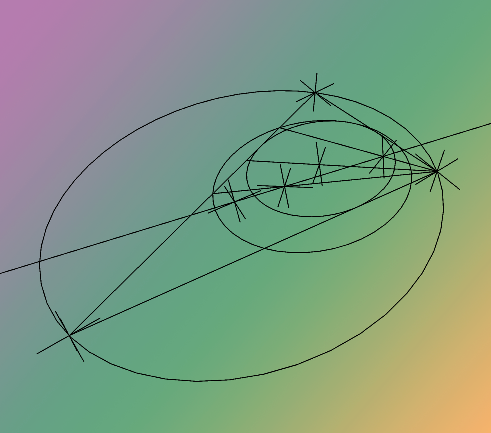

# GeoBlender: A 3D geometry plugin for Blender
---

The purpose of this plugin is to make it much easier to apply mathematical and geometric transformations on objects which are not easily done in Blender natively. Examples of such operations are:

- Creating a plane / circle that goes through any given 3 points
- Finding circumcenters / barycenters / incenters / inscribed circles for given triangles
- Bisectors, Medians, Midpoints, Altitudes 
- and more to come in the future.

---

Along with this, here we develop a miniature framework to help write code to easily perform all of these geometric transformations, and provides a layer on top of Blender to remove a lot of the unnecessary boilerplate code needed to add constraints, drivers, etc. directly through Python.
